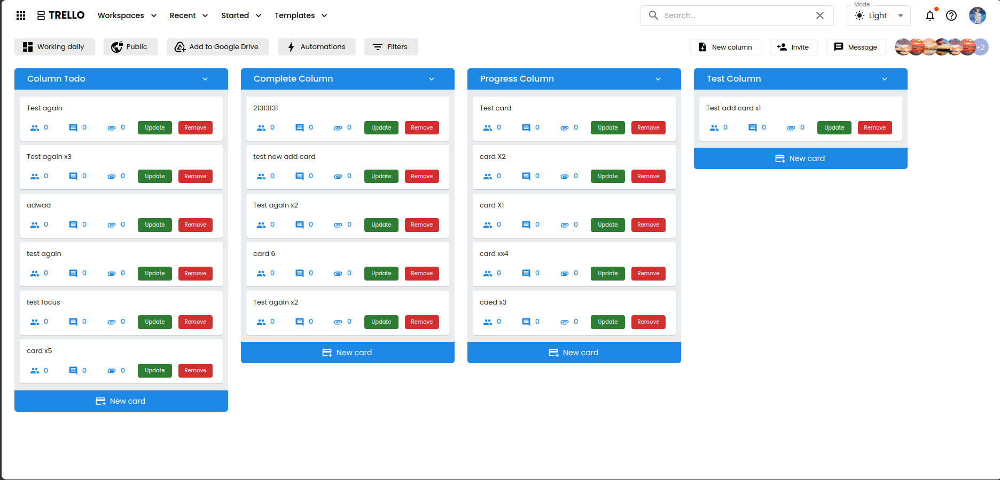

# Trello

## 

## Table of Contents

- [About the Project](#about-the-project)
- [Features](#features)
- [Technologies Used](#technologies-used)
- [Project Structure](#project-structure)

---

## About the Project

This is Project clone trello application using MERN stack with Typescript

## Features

- Impletation using JWT to create access token and refresh token auto refresh token when access token is expired
- Upload file to cloudinary
- Caching using data Redis using Redis
- Rate litmiting using Redis, CORS, Cookie managing access token and refresh token, blacklist refresh token
- Verify two step using third application like SafeAuth, verification user and recover password by email
- Pagination for get list data
- Notification, Chating with Socket.io
- Invatation menebers and comment in post
- Autocomplete search
- Drag and drop card using dnd-kit library
- Indexing to Optimize query to database
- validation data using React-hook-form with zod

## Technologies Used

List the key technologies, frameworks, and libraries used in this project:

- [Node.js](https://nodejs.org/)
- [Express.js](https://expressjs.com/)
- [MongoDB](https://www.mongodb.com/)
- [React](https://reactjs.org/)
- [Redux-toolkit](https://reactjs.org/)
- [Socket.io](https://reactjs.org/)
- [Dnd-kit](https://reactjs.org/)
- ...

## Project-structure

- Apply clean architecture for proejct to easy scale
